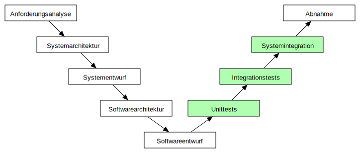
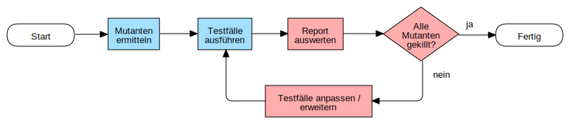
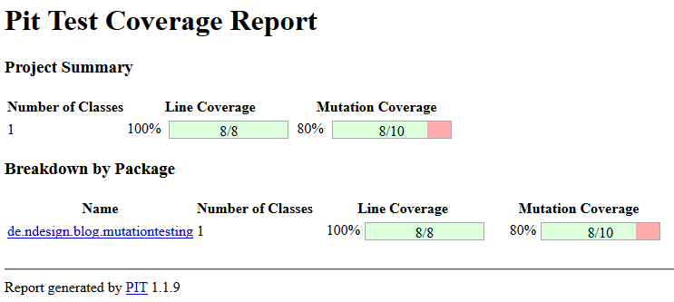
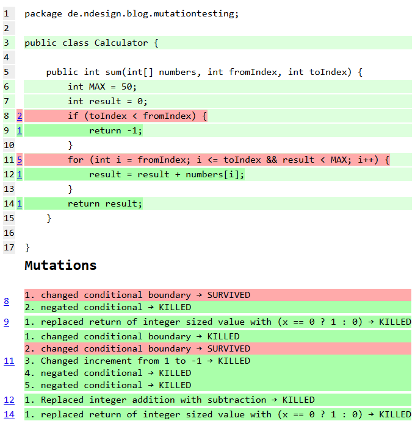
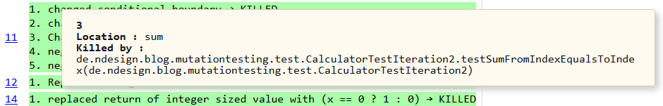

# Mutation Testing

## Was ist Mutation Testing?

Ein sehr interessanter Vortrag im Rahmen der _JavaLand 2016_ - Konferenz behandelte das Thema _Mutation Testing_. Mutation Testing beschreibt ein Verfahren zur Qualitätssicherung *bestehender* Unit-Tests. 

Im klassischen V-Modell der Softwareentwicklung stellen die Teststufen _Unit-Tests_, _Integrationstests_ und _Systemintegration_ (grün markiert) aufeinander aufbauend die Evaluierung eines Softwaresystems dar. Dabei basiert die Aussagekraft jeder Stufe auf der Fehlerfreiheit der vorherigen Stufe. Hieraus ergibt sich die Wichtigkeit von qualitativ guten Unit-Tests in der ersten Teststufe.

Interessiert an der stetigen Qualitätsverbesserung des eigenen Quellcodes und der Unit-Tests, soll im Rahmen dieses Blog-Beitrags das Thema Mutation Testing unter folgenden Gesichtspunkten untersucht und bewertet werden:

* Bietet Mutation Testing wirklich einen Mehrwert? Führt es zu...
** ...besseren Tests?
** ...besserem Quellcode?
** ...besseren Entwicklern?
* Wiegt erwarteter Mehrwert den höheren Aufwand auf?

 

## Wie geht das? - Und wie kommt man auf sowas!?

Definieren wir zunächst die Begrifflichkeiten: Die fürs Mutation Testing namensgebende _Mutation_ stellt eine kleine Änderung im Quellcode dar. Beachtenswert ist hier die Tatsache, dass nicht der Unit-Test verändert wird, sondern der Quellcode. Demzufolge ist ein _Mutant_ eine Version des Quellcodes in einer mutierten Version.

Das nun zu erwartende Ergebnis bei der Ausführung aller bereits existierenden Unit-Tests gegen einen Mutanten, ist *mindestens* ein fehlgeschlagener Unit-Test. Ist dies der Fall, so wird der Mutant als _gekillt_ bezeichnet. Folglich misst sich die Qualität der Unit-Tests am Prozentsatz der gekillten Mutanten, sprich: Je mehr mögliche Mutationen im Quellcode durch Unit-Tests entdeckt werden, desto besser ist deren Qualität.

Dabei basiert Mutation Testing im allgemeinen, und verschiedene Arten von Mutationen im speziellen, auf zwei grundlegenden Hypothesen:

Die *_Competent Programmer Hypothesis_* geht von der Annahme aus, dass Programmierer Programme schreiben, die nahezu perfekt sind. Daraus folgt, dass Programmierfehler syntaktisch klein und leicht behebbar sind. Sie sind _Einfache Fehler_, also Fehler, die mit *einer* Änderung im Quellcode behoben werden können. Jeder Mutant "simuliert" exakt einen solchen einfachen Programmierfehler.

Die *_Coupling Hypothesis_* definiert nun, dass _Komplexe Fehler_ zumeist an Einfache Fehler gebunden sind. Komplexe Fehler sind Fehler, deren Behebung mehrere Änderungen im Quellcode erfordern. Aus dieser Annahme ergibt sich, dass Tests, die Einfache Fehler finden, zu einem sehr hohen Prozentsatz auch Komplexe Fehler finden, die sich etwa aus der Kombination mehrerer Einfacher Fehler ergeben. Dies bedeutet, dass Tests, die *alle* Einfachen Mutanten (Eine Mutation) killen, zu einem Großteil auch Komplexe Mutanten (Mehrere Mutationen) killen.

[NOTE]
====
* Mutation: Änderung im Quellcode
* Mutant: Version des Quellcodes in einer mutierten Version
* Einfache Fehler: Fehler, die mit *einer* Änderung im Quellcode behoben werden können +
-> Einfache Mutanten
* Komplexe Fehler: Fehler, die *nicht* mit *einer* Änderung im Quellcode behoben werden können +
-> Komplexe Mutanten
====

					
## Welche Arten von Mutationen gibt es?

Ausgehend von den vorangegangenen Hypothesen ergeben sich verschiedene Möglichkeiten zur "Simulation" Einfacher Fehler durch verschiedene Arten von Einfachen Mutationen. Diese werden im folgenden anhand der abgebildeten Java-Methode demonstriert.

[source,java]
----
int sum(int[] numbers, int fromIndex, int toIndex) {
    int MAX = 50;
    int result = 0;
    if (toIndex < fromIndex) {
        return -1;
    }
    for (int i = fromIndex; i <= toIndex && result < MAX; i++) {
        result = result + numbers[i];
    }
    return result;
}
----

Diese Methode soll Ganzzahlen eines übergebenen Arrays zwischen zwei Indices summieren. Ist dabei der End-Index kleiner als der Start-Index, wird der Wert `-1` retourniert. Wurde darüberhinaus beim Aufsummieren ein maximaler Wert überschritten, so wird die Summation nicht fortgeführt.

### Value Mutation

Eine _Value Mutation_ bezeichnet die Art der Mutation, bei der Werte von Konstanten oder Parametern verändert werden.

[source,java]
----
int sum(int[] numbers, int fromIndex, int toIndex) {
    int MAX = 40; <1>
    int result = 0;
    if (99 < fromIndex) { <2>
    	return -1;
    }
    for (int i = 33; i <= toIndex && result < MAX; i++) { <3>
    	result = result + numbers[i];
    }
    return result;
}
----
<1> Mutation von `50` nach `40`
<2> Mutation von `toIndex` nach `99`
<3> Mutation von `fromIndex` nach `33`

### Decision Mutation

Eine _Decision Mutation_ bezeichnet die Art der Mutation, bei der Konditionen verändert werden.

[source,java]
----
int sum(int[] numbers, int fromIndex, int toIndex) {
    int MAX = 50;
    int result = 0;
    if (toIndex <= fromIndex) { <1>
    	return -1;
    }
    for (int i = fromIndex; i > toIndex || result < MAX; i++) { <2>
    	result = result + numbers[i];
    }
    return result;
}
----
<1> Mutation von `<` nach `\<=`
<2> Mutation von `<` nach `>` und `&&` nach `||`

### Statement Mutation

Eine _Statement Mutation_ bezeichnet die Art der Mutation, bei ganze Zeilen verschoben, dupliziert oder gelöscht werden.

[source,java]
----
int sum(int[] numbers, int fromIndex, int toIndex) {
    int MAX = 50;
    int result = 0;
    if (toIndex < fromIndex) {
    	<1>
    }
    for (int i = fromIndex; i <= toIndex && result < MAX; i++) {
        result = result + numbers[i];
        result = result + numbers[i]; <2>
    }
    return result;
}
----
<1> Löschen der Zeile
<2> Duplizieren der Zeile

[NOTE]
====
* Value Mutation: Werte von Konstanten oder Parametern werden verändert
* Decision Mutation: Konditionen verändert werden
* Statement Mutation: Ganze Zeilen werden verschoben, dupliziert oder gelöscht
====

## Genug Theorie! Wie sieht das in der Praxis aus!?

Um die Anwendbarkeit im Entwickler-Alltag festzustellen und eine Grundlage für die Bewertung unter eingangs erwähnten Gesichtspunkten zu schaffen, soll an dieser Stelle obige Java-Methode durch Unit-Tests getestet und anschließend deren Qualität mittels Mutation Testing ermittelt werden.

Zur Anwendung für ein Praxisbeispiel kommt hierbei das quelloffene Mutation-Testing-Framework _Pitest_ <<pitest>>. Dabei steht Pitest, das sich als Addition zu JUnit versteht, unter anderem in Versionen zur Verwendung in Maven, Ant, Gradle und über die Kommandozeile bereit.

### Ablauf

Das folgende Diagramm zeigt den Ablauf der Qualitätssicherung von Unit-Testfällen bei der Verwendung von Pitest. Dabei sind alle Aktivitäten, die das Framework übernimmt, [blue]*blau* markiert, während alle Aktivitäten, die der Benutzer selbst erledigen muss, [red]*rot* markiert.

Zunächst ermittelt das Framework alle möglichen Mutanten, was je nach Umfang und Komplexität des Quellcodes eine erhebliche Zahl sein kann. Da viele Mutanten jedoch äquvalent zueinander sind (= _symmetrisch_), kann deren Zahl durch Eliminierung deutlich verringert werden. Hierbei arbeitet Pitest auf Ebene des Java-Bytecodes. Anschließend werden alle JUnit-Testfälle ausgeführt, wobei die Anzahl der gekillten Mutanten und die allgemeine Line-Coverage festgestellt und in einem Report im HTML-Format dokumentiert wird. Es liegt nun am Benutzer, diesen Report auszuwerten und zu entscheiden, ob die ermittelte Testfall-Qualität den Ansprüchen genügt, oder ob Tests angepasst oder gar neue Tests hinzugefügt werden sollen, bis die gewünschte Qualität erreicht ist.

### Ein Beispiel - Iteration 1: Der erste Durchlauf

Nachfolgend finden sich drei JUnit-Testmethoden, die zuvor erwähnte `sum`-Methode testen. Dabei werden alle fachlich möglichen Fälle getestet und eine Line-Coverage von 100% erreicht.

Hinweis: Das Beispiel ist als lauffähiges Projekt auf <<github>> zu finden.

[source,java]
----
@Test
public void testSum() {
    // Prepare
    int[] numbers = { 1, 1, 1, 2, 2, 2, 1, 1, 1 };
    int fromIndex = 3;
    int toIndex = 6;
    int expectedResult = 7;
    Calculator sut = new Calculator();
    // Act
    int result = sut.sum(numbers, fromIndex, toIndex);
    // Verify
    Assert.assertEquals(expectedResult, result);
}

@Test
public void testSumWithToIndexBiggerThanFromIndex() {
    // Prepare
    int[] numbers = { 1, 1, 1, 2, 2, 2, 1, 1, 1 };
    int fromIndex = 6;
    int toIndex = 3;
    int expectedResult = -1;
    Calculator sut = new Calculator();
    // Act
    int result = sut.sum(numbers, fromIndex, toIndex);
    // Verify
    Assert.assertEquals(expectedResult, result);
}

@Test
public void testSumWithMaximumReached() {
    // Prepare
    int[] numbers = { 1, 1, 1, 40, 20, 2, 1, 1, 1 };
    int fromIndex = 3;
    int toIndex = 6;
    int expectedResult = 60;
    Calculator sut = new Calculator();
    // Act
    int result = sut.sum(numbers, fromIndex, toIndex);
    // Verify
    Assert.assertEquals(expectedResult, result);
}
----

Diese JUnit-Tests werden nun über das von Pitest angebotene Maven-Plugin ausgeführt. Die entsprechende Konfiguration der `pom.xml`-Datei sieht dabei wie folgt aus:

[source, xml]
----
<build>
	<plugins>
		<plugin>
			<groupId>org.pitest</groupId>
			<artifactId>pitest-maven</artifactId>
			<version>1.1.9</version>
			<configuration>
				<targetClasses>
					<param>de.ndesign.blog.mutationtesting*</param> <1>
				</targetClasses>
				<targetTests>
					<param>de.ndesign.blog.mutationtesting.test*</param> <2>
				</targetTests>
			</configuration>
		</plugin> 
	</plugins>
</build>
----
<1> Alle Klassen, für die zuerst Mutanten bestimmt werden und anschließend ermittelt wird, wie viele dieser Mutanten durch die angegebenen JUnit-Tests gekillt worden sind.
<2> Alle Klassen mit JUnit-Tests, die ausgeführt werden sollen.

Die Ausführung des Maven-Goals `org.pitest:pitest-maven:mutationCoverage` liefert anschließend einen Pitest-Report unter `target/pit-reports/YYYYMMDD/index.html`, dessen Startseite in der folgenden Abbildung dargestellt wird.

Diese Startseite liefert eine Zusammenfassung der Testergebnisse und zeigt die erreichte Line-Coverage und die Zahl der gekillten Mutanten (Mutation Coverage). Folgt man dem Link zur detaillierten Ansicht eines Java-Packages findet man sich in nachfolgender Ansicht wieder.

Hier erkennt man eine "detaillierte" Übersicht über die getesteten Klassen, Testklassen und eine Auswertung der durch die Testklassen gekillten Mutationen. So wurden für zuvor vorgestellte Methode `sum` zehn verschiedene Möglichkeiten zur Mutation ermittelt. Deren Ausführung zeigt, dass hiervon lediglich acht Mutationen durch die entworfenen Tests gekillt wurden.

### Ein Beispiel - Iteration 2: Anpassen der Tests

Hat man nun den Anspruch alle Mutanten zu killen und die bestmögliche Qualität an Tests zu erreichen, müssen nun Änderungen oder gar Ergänzungen an den bestehenden Testfällen vorgenommen werden. Hierzu werden zwei Tests ergänzt, die die beiden "lebenden" Mutanten killen.

[source,java]
----
@Test
public void testSumFromIndexEqualsToIndex() {
    // Prepare
    int[] numbers = { 1, 1, 1, 2, 2, 2, 1, 1, 1 };
    int fromIndex = 3; 
    int toIndex = 3; <1>
    int expectedResult = 2;
    Calculator sut = new Calculator();
    // Act
    int result = sut.sum(numbers, fromIndex, toIndex);
    // Verify
    Assert.assertEquals(expectedResult, result);
}

@Test
public void testSumWithMaximumEquallyReached() {
    // Prepare
    int[] numbers = { 1, 1, 1, 40, 10, 2, 1, 1, 1 }; <2>
    int fromIndex = 3;
    int toIndex = 6;
    int expectedResult = 50;
    Calculator sut = new Calculator();
    // Act
    int result = sut.sum(numbers, fromIndex, toIndex);
    // Verify
    Assert.assertEquals(expectedResult, result);
}
----
<1> `fromIndex` identisch mit `toIndex`
<2> `MAX` wird *genau* erreicht

### Ein Beispiel - Iteration 3: Fertig?

Ein weiterer Durchlauf zeigt, dass nun alle Mutanten gekillt wurden. Der Pitest-Report liefert eine hundertprozentige Line- und Mutation-Coverage. Der letzte Schritt könnte nun sein, "überflüssige" Tests zu entfernen, sprich Tests, die für eine vollständige Code- und Mutation-Coverage nicht notwentig sind. Hierzu zeigt der Pitest-Report ein Mouse-Hover-Popup beim Überfahren der gekillten Mutationen.

Dies würde im vorliegenden Beispiel etwa bedeuten, dass die ursprünglich entworfenen Tests `testSum` und `testSumWithMaximumReached` überflüssig geworden sind und entfernt werden könnten. Als Ergebnis hat man nun Tests, deren reine Anzahl identisch zur ursprünglichen Anzahl ist, die sich jedoch hinsichtlich ihrer Qualität voneinander unterscheiden.

# Auswertung: Lohnt sich das?!

*Bietet Mutation Testing wirklich einen Mehrwert? Führt es zu...*

* ...besseren Tests? *-> Ja!*
+
Ja, der Einsatz von Mutation Testing führt zu besseren Unit-Tests. Es stellt einen Rahmen zur Einhaltung von testtheoretischen Kriterien (Äquivalenzklassenbildung, Grenzwerttestung, etc.) dar und ist ein gutes Kontrollwerkzeug mit einem sehr simplen Bewertungkriterium ("Prozentsatz gekillter Mutanten").

* ...besserem Quellcode? *-> Nein!*
+
Nein, der Einsatz von Mutation Testing führt nicht zu besserem Quellcode. Dies war jedoch auch nicht zu erwarten, da Mutation Testing bereits in seinem Entwurf lediglich ein Mittel zur Qualitätssicherung von Unit-Tests darstellen kann. *Aber:* Qualitativ bessere Tests führen natürlich zu fehlerfreierem Quellcode!

* ...besseren Entwicklern? *-> Ja!*
+
Ja, der Einsatz von Mutation Testing führt zu besseren Entwicklern, denn: "Aus Fehlern lernt man!". Das wiederkehrende _vor-Augen-führen_ der Qualität seiner Unit-Tests und das hinweisen auf nicht-gekillte Mutanten führt dazu, dass sich Entwickler mehr Gedanken um die Anzahl, den Umfang, den Aufbau und den Inhalt ihrer zu implementierenden Unit-Tests machen. Dies führt mit der Zeit zu besseren Entwicklern, die auch ohne den Einsatz von Mutation-Testing-Kontrollwerkzeugen bessere Unit-Tests schreiben würden.

*Unerwarteter Mehrwert!*

Zusätzlich bildet sich bei Betrachtung des Mutation Testings jedoch ein unerwarteter Mehrwert heraus. Der eigentliche Mehrwert bei der Verwendung von Mutation Testing kommt erst mit fortschreitender Projektdauer zum Tragen, nämlich dann, wenn die ständige Weiterentwicklung (= _Refactoring_) von Code zu Fehlern führt, die exakt den durch unterschiedliche Mutationen abgebildeten Fehlern entsprechen. Mutation Testing kann hier folglich zu Unit-Tests führen, die ebensolche Fehler vermeiden. Darüberhinaus dient es zur Sicherstellung der Qualität der Unit-Tests VOR dem Refactoring, sodass die Wahrscheinlichkeit des identischen Verhaltens im Vergleich zum vorherigen Software-Stand definitiv erhöht werden kann.

*Wiegt erwarteter Mehrwert höheren Aufwand auf? -> Nein!*

Der zu erwartende Mehrwert kann dennoch leider nicht den höheren Aufwand aufwiegen. Mutation Testing ist ein Werkzeug, das ausschließlich in Addition zu einem bestehenden Testing-Framework verwendet werden kann. Per Definition bedeutet "Addition" natürlich auch immer Mehraufwand. Darüberhinaus zeigt das vorgestellte Beispiel mit einer sehr einfachen zu testenden Methode, dass bereits hierfür einige manuelle Iterationen zu durchlaufen sind. Hier fehlt es selbst einem guten Werkzeug wie Pitest an Automatisierung was zum Beispiel das Interpretieren von Reports und daraus resultierenden Vorschlägen zu Anpassungen/Erweiterungen der getesteten Unit-Tests betrifft. Das Fehlen einer solchen Automatisierung fällt dabei mit steigendem Umfang des zu testenden Quellcodes immer mehr ins Gewicht.

*Ergebnis*

Jene fehlende Toolunterstützung stellt den Hauptkritikpunkt dar: Obwohl Pitest das wohl verbreitetste aktiv weiterentwickelte Mutation-Testing-Tool ist, ist dessen Funktionsumfang eingeschränkt. Die Suche nach Alternativen ist darüberhinaus wenig erfolgversprechend. Es exsitieren zwar eine Reihe weiterer Tools, deren Entwicklung sich jedoch, vermutlich nicht grundlos, weitestgehend im Sand verlaufen hat. So stellt Mutation Testing zusammenfassend ein spannendes theoretisches Konzept vor, dessen praktische Verwendbarkeit jedoch nicht gewährleistet werden kann.

	
[[[pitest]]] http://pitest.org/ +
[[[github]]] https://github.com/moetz87/de.ndesign.blog.mutationtesting